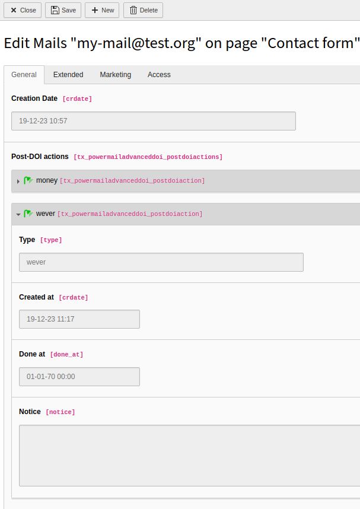

# TYPO3 Extension powermail\_advanced\_doi

Advanced DOI handling for EXT:powermail

## What's it for?

By default in EXT:powermail the backend user (editor) decides whether or not the
user should confirm their request with clicking the link in a DOI mail before
it's sent to the receiver.

With this extension it's possible to add special checkboxes that with enforce a
DOI mail if at least one of them is checked by the frontend user.

Each of these checked checkboxes will cause a "Post DOI action" record
to be created after DOI and can be processed independently of each other.



## Setup

### TypoScript

Include this extension's TS right after the one of EXT:powermail.

Check the property `plugin.tx_powermail.view.partialRootPaths` and the order of
its indices in case the new field type is not rendered properly.

### Form fields

#### Checkbox

Add a field of type "Checkboxes with Post-DOI action" (`check_post_doi_actions`)
with the usual checkbox settings syntax:

```
Yes, I'd like to subscribe for the newsletter|newsletter
Yes, I'd like to take part in the survey|survey
Yes, I'd like to win something fancy|tombola
```

Those fields are being rendered just like any regular checkbox.

#### Hidden

Add a field of type "Hidden Field with Post-DOI action" (`hidden_post_doi_action`)
with a default value like `newsletter`.

Those fields are being rendered just like any regular hidden field.

### Asynchronous processing of these post DOI actions

On clicking the DOI link for each of the checked checkboxes a "Post DOI action"
record will be created in the database.

Implement a scheduler task to handle each of these records. That's on you!
